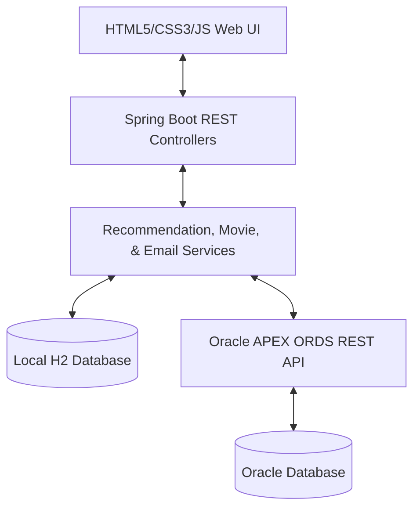

# CineMatch: Hybrid Movie Recommendation System

CineMatch is a modern, full-stack **Hybrid Movie Recommendation System** that leverages User-Based Collaborative Filtering, Content-Based Filtering, and integration with **Oracle APEX REST (ORDS)** to deliver high-quality, personalized film suggestions. It features a premium, responsive glassmorphism dark UI with real-time ratings, reviews, watchlist management, TMDB media integration, and a dedicated AI assistant.

---

## 🚀 Features

*   **Hybrid Recommendation Engine**:
    *   **Oracle APEX Integration (Primary)**: Queries an Oracle Database via APEX REST endpoints (`ORDS`) for advanced, database-level hybrid recommendations.
    *   **Local Java Engine (Fallback)**: Combines User-Based Collaborative Filtering (using Cosine Similarity on user rating vectors) and Content-Based Filtering (genre-based preference matching).
    *   **Cold-Start Mitigation**: Automatically serves popular movie recommendations for new users with no rating history.
*   **Interactive Web UI**:
    *   Sleek Dark/Light responsive glassmorphism design with responsive grid layouts.
    *   **Collapsible Left Navigation Sidebar**: Clean left-side navigation for both authenticated users and guests, supporting collapse/drawer states on mobile screens.
    *   **Stacked Theme Toggle**: Integrates a seamless stacked Dark/Light mode toggle directly inside the sidebar (active and functional for both members and guests).
    *   Dynamic spotlight movie banners and category/genre quick filters.
    *   **Recently Added Badges**: Displays a vibrant emerald badge for new titles added to the library (within 2026).
    *   Interactive rating modals allowing users to leave star ratings and reviews.
    *   Watchlist management (Save for Later / Mark as Watched).
*   **CineBot AI Assistant**:
    *   An interactive floating AI chatbot widget located at the **bottom-right** of the viewport.
    *   Supports dynamic movie suggestions. Clicking any suggested movie card (or its poster) automatically collapses the chatbot and opens the detailed movie information modal.
*   **Secure Authentication & Verification**:
    *   Includes registration verification with automatically dispatched **Welcoming emails containing 6-digit OTP codes** to verify member sign-ups.
*   **Optimized Cloud Footprint**:
    *   Memory-optimized startup cycle that skips heavy raw local dataset parses (`movies.dat`) to prevent cloud container Out-Of-Memory (OOM) crashes, running reliably within constrained instances like Railway.
*   **H2 Database Cache**:
    *   File-based local persistent caching to guarantee user session, watchlist, review, and rating persistence across restarts.

---

## 🛠️ Tech Stack

*   **Backend**: Spring Boot 3.x, Spring Data JPA, Hibernate, Java Mail Sender
*   **Database**: H2 Database (local file-based), Oracle Database (external via REST/ORDS)
*   **Frontend**: HTML5, CSS3 (Custom Vanilla CSS with HSL/Glassmorphism variables), JavaScript (Vanilla ES6 SPA)
*   **APIs**: TMDB Image CDN, Oracle APEX ORDS

---

## 📐 Architecture



---

## 📂 Project Structure

```text
src/
├── main/
├── java/com/recommend/movie/
│   │   ├── config/             # Database Seeding, Loader, & Security Configs
│   │   ├── controller/         # REST API Endpoints (Movie, User, Chat, etc.)
│   │   ├── dto/                # Data Transfer Objects
│   │   ├── model/              # JPA Database Entities (Movie, User, Rating, Episode)
│   │   ├── repository/         # Spring Data JPA Repositories
│   │   ├── service/            # Hybrid Recommendation, Email, & Movie Services
│   │   └── MovieApplication.java
│   └── resources/
│       ├── static/             # Frontend Client Web Assets
│       │   ├── css/style.css   # Custom Glassmorphism styles
│       │   ├── js/app.js       # SPA Frontend Application Logic
│       │   └── index.html      # Single Page Application entry point
│       └── application.properties # Server, DB, Mail, & Oracle APEX configs
└── pom.xml                     # Maven Dependencies
```

---

## ⚙️ Setup and Installation

### Prerequisites
*   **Java**: JDK 17 or higher (Java 25+ fully supported)
*   **Maven**: 3.8+ (wrapper/local installation)

### 1. Run the Spring Boot App
Clone the repository, open a terminal in the root directory, and compile and execute the application:

```bash
mvn spring-boot:run
```

### 2. Access the Application
*   **Production Deployment**: [https://movie-recommendation-system-production-dab5.up.railway.app](https://movie-recommendation-system-production-dab5.up.railway.app)
*   **Web Dashboard (Local)**: [http://localhost:8080](http://localhost:8080)
*   **H2 Web Console**: [http://localhost:8080/h2-console](http://localhost:8080/h2-console)
    *   **JDBC URL**: `jdbc:h2:file:./data/moviedb`
    *   **Username**: `sa`
    *   **Password**: *(leave empty)*

---

## 🔌 Configuration

You can configure the database path and target Oracle APEX recommendation endpoint inside `src/main/resources/application.properties`:

```properties
# Server Port
server.port=8080

# H2 Database configuration
spring.datasource.url=jdbc:h2:file:./data/moviedb;DB_CLOSE_DELAY=-1;DB_CLOSE_ON_EXIT=FALSE
spring.datasource.username=sa
spring.datasource.password=

# Oracle APEX ORDS API Integration
oracle.apex.api.url=https://apex.oracle.com/ords/*********************/api

# SMTP Email Configuration (For welcome emails and OTP verification)
spring.mail.host=smtp.gmail.com
spring.mail.port=587
spring.mail.username=********@gmail.com
spring.mail.password=**********
```

---

## 📡 API Endpoints

### Movies
*   `GET /api/movies` - Retrieve all movies in the system.
*   `POST /api/movies/{id}/rate?userId={u}&score={s}` - Add or update a movie rating.
*   `POST /api/movies/{id}/review?userId={u}` - Leave a text review for a movie.

### Recommendations
*   `GET /api/recommendations?userId={id}` - Fetch custom hybrid recommendations for a user.

### Users
*   `GET /api/users/profile?userId={id}` - Fetch user details, ratings, watchlist, and preferred genres.
*   `POST /api/users/register` - Register a new user profile.
*   `POST /api/users/verify-otp` - Verify email using the OTP sent during registration.

### AI Assistant (Chat)
*   `POST /api/chat` - Interact with the CineBot AI Assistant.

---

## 🤝 Contributing & Welcoming Contributors

Welcome to CineMatch! We are highly open to community contributions and support. Whether you want to:
*   Add new recommender algorithm models (e.g., Pearson Correlation, Matrix Factorization).
*   Optimize frontend design, responsiveness, or glassmorphism aesthetics.
*   Improve database synchronization layers and caching modules.
*   Resolve bug issues and expand the test suite coverage.

Feel free to fork the repository, make your enhancements, and submit a Pull Request. We welcome developers of all skill levels! Happy coding! 🎬🍿
